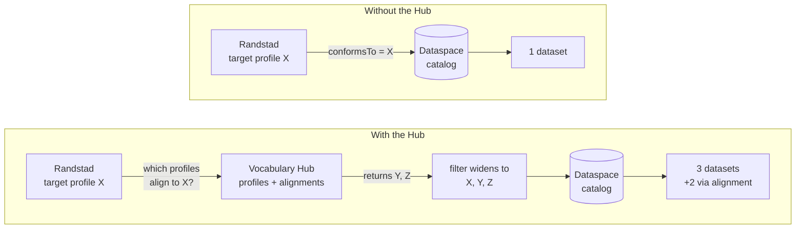

# Simulator User Stories

Stories the simulator should satisfy, derived from exploratory testing. The evidence behind
US-1 to US-5 is in `TEST-LOG.md`.

US-1 to US-5 are **defects**: behaviour the simulator claims and does not deliver.
US-6 is a **capability** that does not exist yet.

## 1) Defect-derived stories

### US-1 — Discovery respects access policy

> As a data consumer browsing a provider's catalog, I want to see only the assets my
> credentials entitle me to, so that discovery reflects my real access rights.

Acceptance:
- Browsing a catalog produces the same visible set as semantic search for the same
  participant.

Covers T-01. T-02 already passes.

### US-2 — A dataset declares its semantic model, resolvably

> As a data provider, I want to attach a resolvable link to the model my dataset conforms
> to, and have consumers see and follow it, so that semantic fit can be assessed before any
> contract is negotiated.

Acceptance:
- `dct:conformsTo` appears on both the catalog entry and the search result.
- It is rendered as a link that opens the model in the Vocabulary Hub.

Covers T-03 and T-05.

### US-3 — Every declared field survives the query

> As a data consumer, I want any metadata field I can filter on to also be returned and
> displayed, so that the catalog does not hide information it demonstrably holds.

Acceptance:
- Filterable and returnable are the same set of predicates.

Generalises T-05 across the ten currently affected fields. **US-6 depends on this.**

### US-4 — A demonstration starts in a known-good state

> As someone demonstrating the simulator, I want a cold start to produce a complete index,
> or to fail loudly, so that I am never presenting partial results as complete.

Acceptance:
- After the documented reset, every seeded asset is searchable.
- Any indexing shortfall is reported as an error, not a success.

Covers T-06.

### US-5 — Access levels read in plain language

> As a participant in a workshop, I want access conditions labelled in words I recognise, so
> that I am not decoding internal identifiers while following an explanation.

Acceptance:
- One access state renders one label.
- Policy names are shown, not policy ids.

Covers T-07.

## 2) US-6 — Discovery widened by alignments

> As a data consumer with a target application profile, I want to ask the Vocabulary Hub
> which other profiles have alignments to mine before I search the dataspace, so that I
> discover datasets I can consume through a known transformation — not only those that
> already match my profile exactly.

### 2.1 Why this is the point

The Vocabulary Hub keeps a catalog of its own, but of *semantic assets* rather than
datasets. It holds two kinds:

- **Application profile** — the data model a dataset conforms to. This is what a dataspace
  catalog entry points at through `dct:conformsTo`.
- **Alignment** — a mapping between two profiles, describing how data expressed in one can
  be understood as the other.

Alignments change what discovery can reach. A consumer with target profile X can consume
datasets conforming to X, but also datasets conforming to any profile for which an
alignment to X exists. Those datasets are invisible to a search filtered on X alone, and
they are exactly the ones the Hub can reveal.



The Hub adds one hop before the dataspace search, and that hop is what widens the filter:
the set of profiles the second query runs on is the result of the first query.

### 2.2 Alignments are directional

An alignment that transforms Y into X is a different claim from one that transforms X
into Y. Alignments are stored and queried as directed edges:

```text
alignment := (source profile, target profile, coverage)
```

The lookup behind US-6 is therefore:

> Return every profile `P` for which an alignment exists with `source = P` and
> `target = X`.

Read as: *profiles whose data can be expressed as X*. Stored as an undirected relation the
demo would over-report reachability and quietly weaken its own argument.

### 2.3 Alignments are partial

An alignment rarely maps a whole model. Each alignment carries a **coverage** indicator:
how much of the target profile it can populate from the source.

Consequences to build in:
- Coverage travels with the result. A hit reads
  `conforms to Y · reachable from X via alignment A1 · 72% coverage`, never a bare
  *reachable*.
- Coverage is filterable. A consumer can set a minimum threshold and exclude alignments too
  thin to be useful.
- The alternative is a binary *reachable?* but this overstates the case where only part of the model maps, which is almost always the case anyway.

### 2.4 No chaining in the base story

Single hop only. If `Z → Y` and `Y → X` both exist, Z is **not** offered as reachable from X. After all, composing alignments is not a matter of multiplying percentages but an intersection. Two alignments at ~70% coverage can therefore compose to near zero.

### 2.5 User journey / acceptance test

- Randstad can query the Hub's semantic asset catalog on its own, without first running a
  dataspace search.
- A lookup of the form *profiles with an alignment to X* returns Y and Z, together with the
  alignment assets that connect them and their coverage figures.
- The dataspace search filter accepts a **set** of profiles, not a single value.
- Each result states the profile it conforms to and, when that is not X, the alignment that
  makes it reachable and its coverage.
- Reachability is single-hop only.
- The same demo run twice is the proof: filter `{X}` returns one dataset, filter
  `{X, Y, Z}` returns three.

### 2.6 What the simulator would need

None of this exists yet. In dependency order:

1. **A Vocabulary Hub component.** Not a seventh participant — in blueprint terms this is a
   dataspace-level service, not a party to contracts. Worth carrying that distinction into
   the visual model rather than flattening it into another connector on the ring. The
   intended implementation exposes a **semantic asset catalog** as one component, reachable
   over external endpoints, so the simulator should model it as a service with an API rather
   than as a local table.

2. **A semantic asset catalog.** Profiles and alignments as first-class records; each
   alignment naming a source profile, a target profile and a coverage figure.

3. **A lookup endpoint.** Given a profile identifier, return the profiles aligned *to* it
   and the alignments that reach them.

4. **Set-valued filtering in the dataspace search.** The current field filter tests one
   value with a substring match (`backend/semantic.js`); this needs membership across a set.

5. **Result provenance.** A result has to be able to say *conforms to Y, reachable from X
   via alignment A1 at 72%*. This depends on **US-3**: while `dct:conformsTo` cannot be
   returned from a query at all, no result can explain itself.

### 2.7 Later variants

- **US-6a — Chained alignments.** Multi-hop reachability with composed coverage computed
  field-by-field. See 2.4 for why this is deliberately out of scope for the base story.
